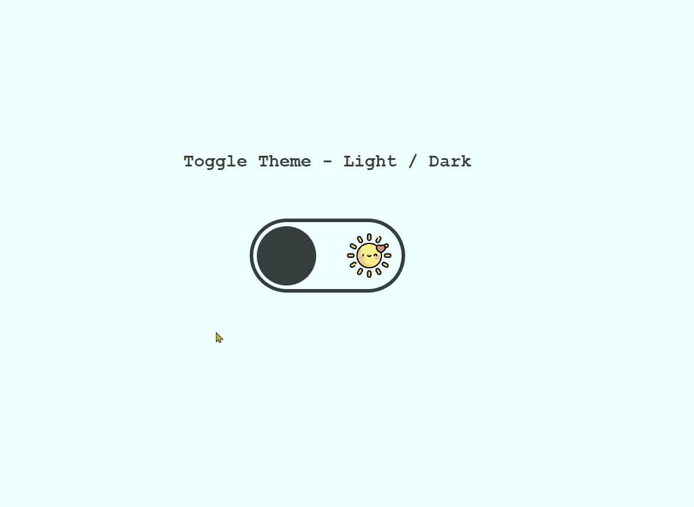

## Mudar o tema não é nenhum bicho de sete cabeças

Este foi um dos primeiros componentes desenvolvidos antes de dar o próximo passo rumo ao React!

 

## Changing the theme is no big deal

This was one of the first components developed before taking the next step towards React!

 

You can view the project via the link:  
https://srbaliardo.github.io/toggle-theme/

 

 

"  |
 |
 "
